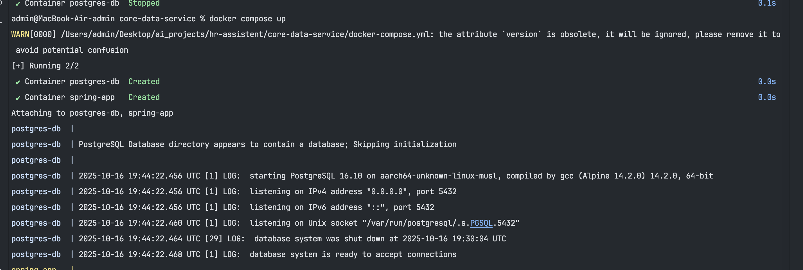
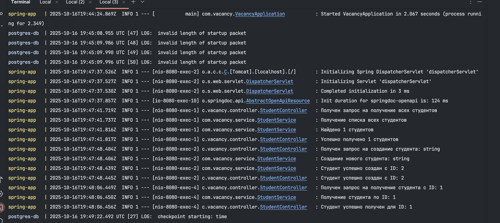
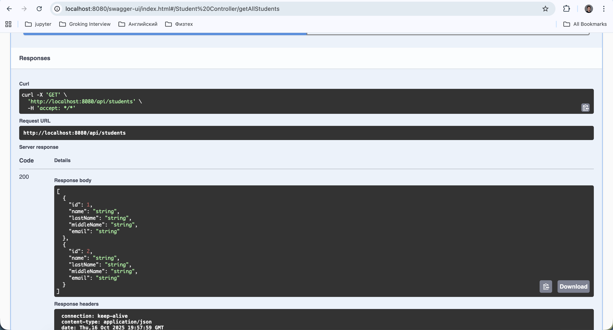

# Репозиторий для лабораторных работ

Для выполнения лабораторной работы использовалось Spring Boot приложение, связанное с базой данных Postgres.
Исходный код лежит в папке lab2
 
Для сборки приложения использовался Dockerfile, который включает в себя 2 независимых этапа:

1. Сборка jar файла при помощи Gradle
2. Запуск jar файла

Команды, используемые при работе с образом приложения:

1. docker build -t spring-app .
2. docker tag spring-app kirillignatev21/spring-app:1.0.0
3. docker push kirillignatev21/spring-app:1.0.0
4. Ссылка на репозиторий докер: https://hub.docker.com/repository/docker/kirillignatev21/spring-app/general

Для сборки и проверки работоспособности требуется:

1. Склонировать к себе репозиторий
2. Перейти в папку lab2
3. Выполнить команду docker compose up
4. Для проверки приложения, необходимо открыть http://localhost:8080/swagger-ui/index.html#/ . После нажатия откроется
   swagger, где можно выполнить CRUD операции.
5. Чтобы убедиться, что БД запустилась можно подключиться со следующими кредами:  
   URL: jdbc:postgresql://localhost:5433/mydb  
   login: postgres 
   password: postgres  
   Далее необходимо открыть схему postgres, где будет таблица student, которая изменяется в зависимости от CRUD-операций

Скриншот с запущенными образами

Демонстрация работы приложения 

Запущенный swagger

