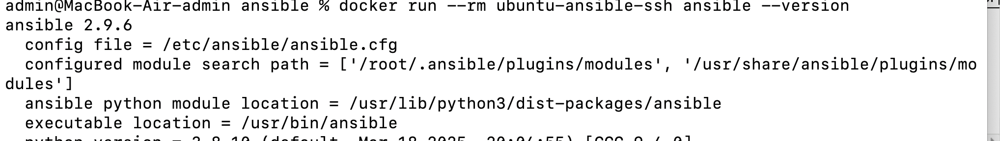
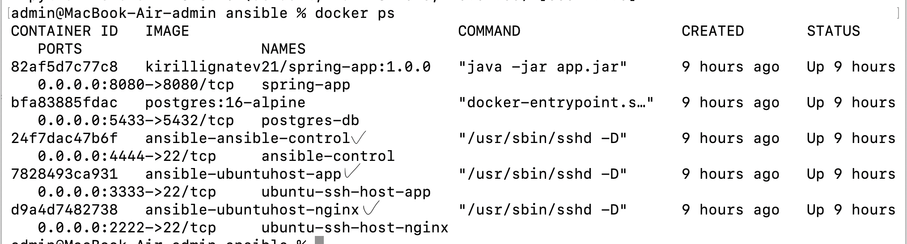
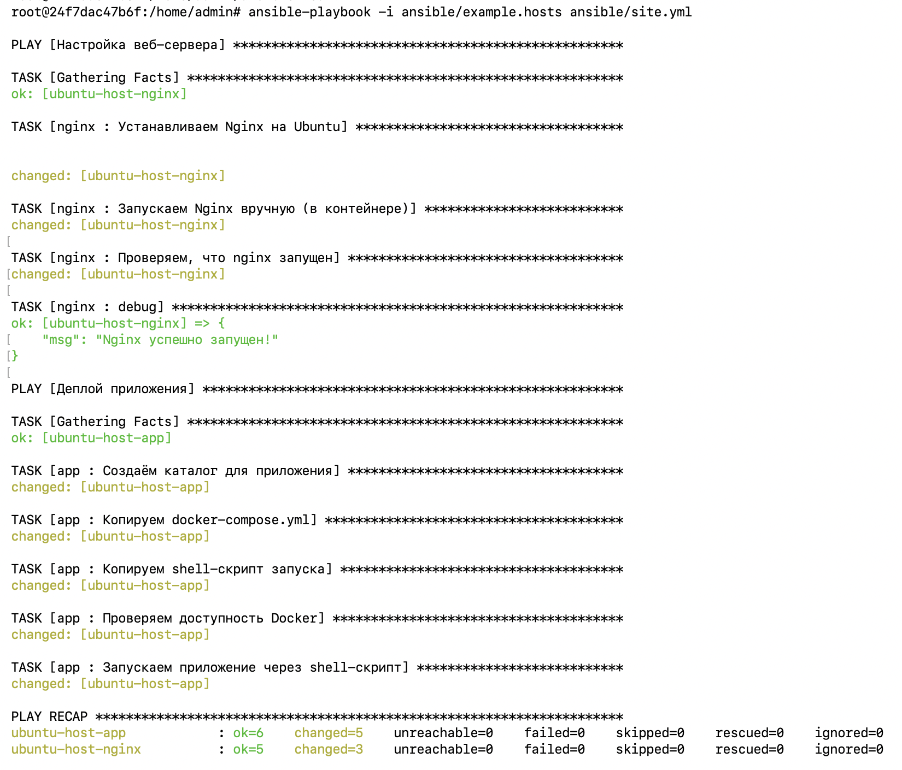
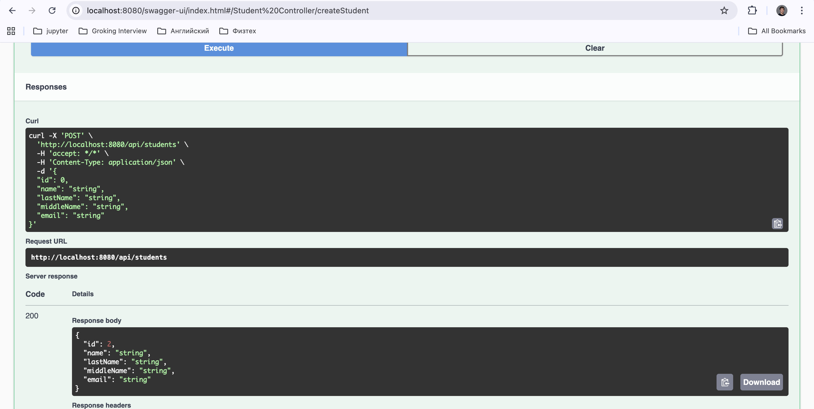
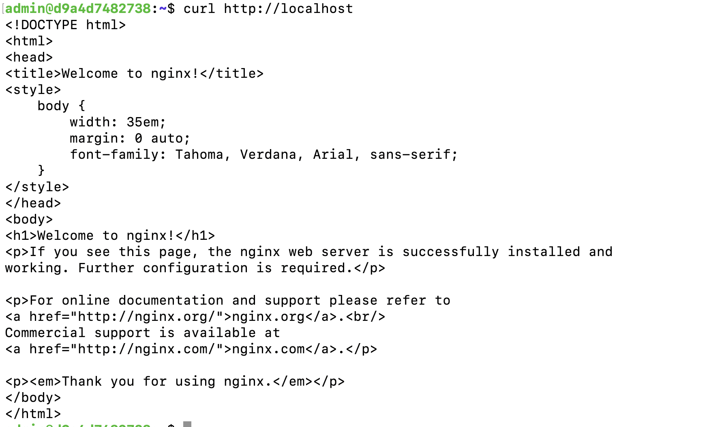

# Ansible 

## Описание

Данный проект реализует инфраструктуру из нескольких контейнеров с помощью **Docker** и автоматизирует их настройку с помощью **Ansible**.

**Цель лабораторной работы** — разработать Ansible playbook с несколькими ролями:
1. Установка и настройка **Nginx** на «чистой машине».
2. Деплой приложения с shell-скриптом его запуска.

Вместо реальных серверов используются **Docker-контейнеры**, объединённые в одну сеть.

Ссылка на репозиторий докер: https://hub.docker.com/repository/docker/kirillignatev21/spring-app/general

## Шаги для воспроизведения проекта 

1. Сборка образа хоста docker  
`build -t ubuntu-ssh -f ./dockerfileUbuntu .`
2. Сборка образа для HostMachine  
`docker build -t ubuntu-ansible-ssh -f ./dockerfileUbuntuHost .`
3. Проверка работы ansible  
`docker run --rm ubuntu-ansible-ssh ansible --version`  
Ожидаемый результат
  
4. Запускаем docker compose, чтобы запустить инфраструктуру  
`docker-compose up -d`
5. Убедиться, что контейнеры запущены:  
`docker ps`

6. Зайти в консоль для работы с ansible-master  
`docker exec -it ansible-control bash`
7. Команда для запуска playbook  
`ansible-playbook -i ansible/example.hosts ansible/site.yml`  
Результат работы:

8. Для проверки приложения можно открыть в браузере `http://localhost:8080/swagger-ui/index.html#/`
Там откроется web-страница, где можно выполнить CRUD операции, чтобы убедиться в работоспособности приложения 

9. Чтобы убедиться в работоспобности nginx, требуется: 
    1. Подключиться по ssh к серверу `ssh admin@localhost -p 2222` и ввести пароль securepassword
    2. Выполнить CURL запрос 'curl http://localhost'
    3. Результат:  
    

