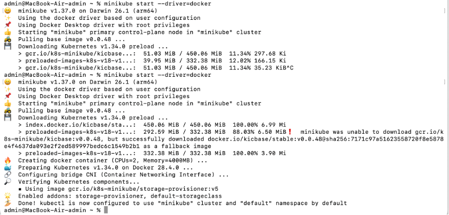
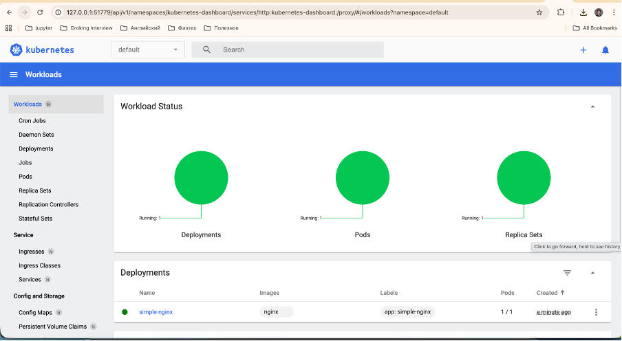
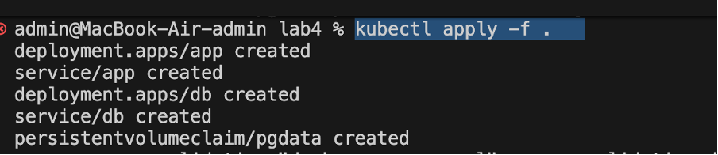
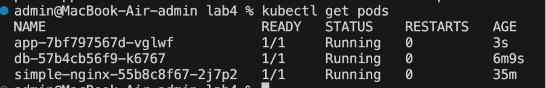
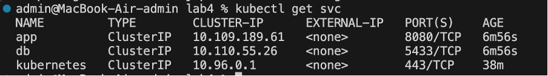
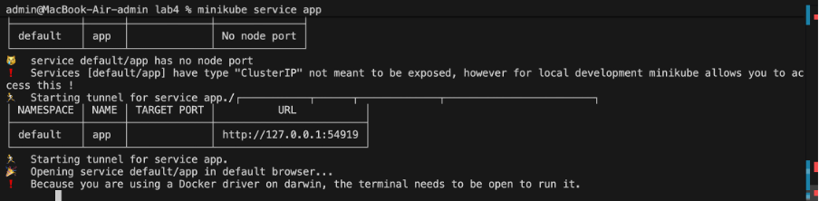
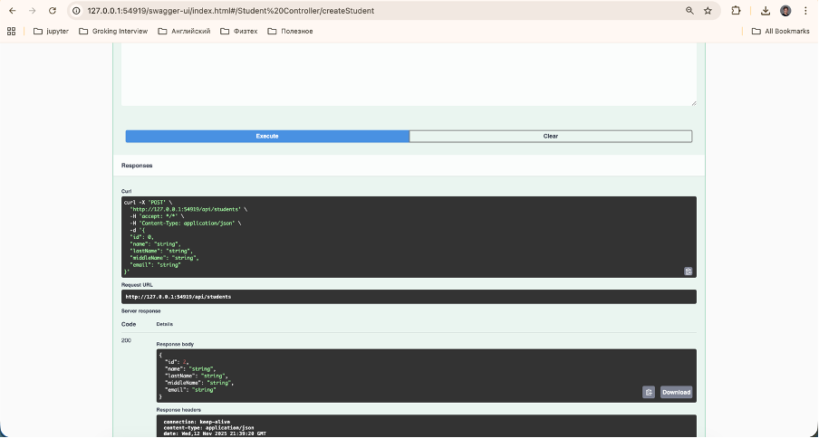
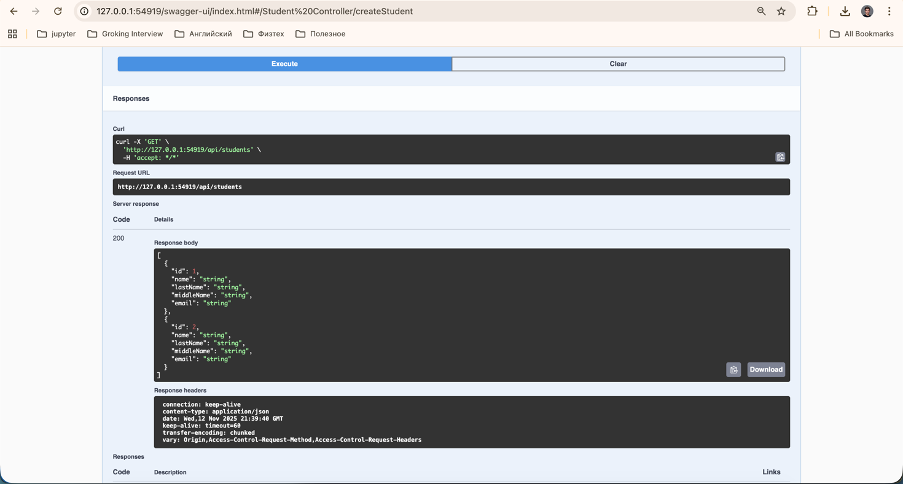
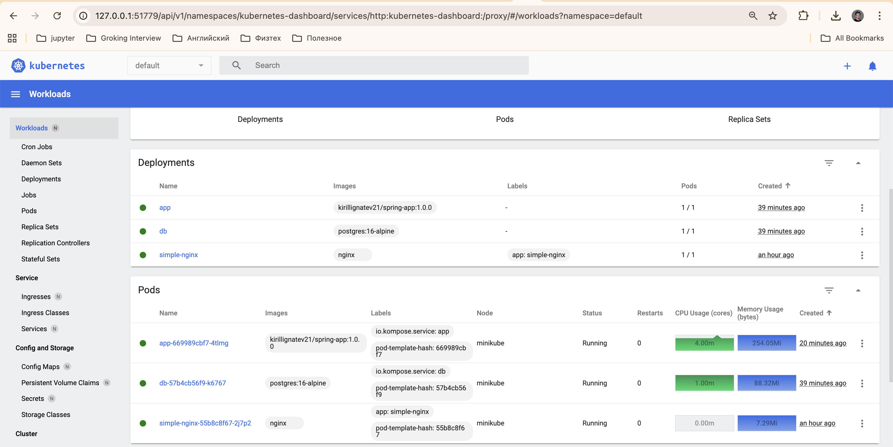

# Лабораторная работа №4 — Оркестрация контейнеров в Kubernetes

## Цель работы

Перенести проект **Docker Compose** из лабораторной работы №2 в **Kubernetes (K8S)** с использованием **Minikube**.

---

## Ход работы

### 1. Установка Minikube

Устанавливаем Minikube при помощи Homebrew:

```bash
brew install minikube
```

---

### 2. Запуск кластера

Запускаем локальный кластер с драйвером Docker:

```bash
minikube start --driver=docker
```


После запуска можно открыть **Minikube Dashboard** для визуального управления:

```bash
minikube dashboard
```



---

### 3. Подготовка файлов для деплоя

Создадим deployment и sevice файлы для Spring приложения и базы данных

---

### 4. Применение конфигурации

Применяем все созданные манифесты:

```bash
kubectl apply -f .
```

## 

### 5. Проверка состояния подов и сервисов

Проверяем, что все поды и сервисы запущены корректно:

```bash
kubectl get pods
kubectl get svc
```

## 

## 

---

### 6. Доступ к приложению

Чтобы получить доступ к приложению, используем:

```bash
minikube service app
```

## 

### 7. Проверка работы API

В **Swagger UI** создаём нового студента и запрашиваем список всех студентов, чтобы убедиться, что сервис функционирует корректно.

## 

## 

## 

## Результат

Проект успешно перенесён из Docker Compose в Kubernetes.  
Приложение работает корректно в локальном кластере Minikube и доступно через сервис Kubernetes.

---
