# Jenkins

## Описание

Цель: необходимо настроить CI/CD, который будет работать в два шага:
1. Build приложения с статическим анализатором кода, запуском Unit-тестов, деплоем образа в nexus
2. Деплой приложения на удаленный сервер с использованием ansible

Описание проделанной работы: для выполнения работы использовалось Java приложение, которое выполяент CRUD операции.
Данное приложение подключается к БД. Репозиторий: https://github.com/goldenchest19/my-app-devops-ex 
также в репозиторий расположение Jenkinsfile, отвечающий за сборку приложения.

Во втором репозитории расположен Jenkinsfile, который отвечает за деплой приложения. Сначала выкачивает его из nexus, затем
перекладывает на host ansible и выполняет запуск на удаленном хосте. Ссылка на репозиторий: https://github.com/goldenchest19/my-app-devops-deploy

Шаги выполнения работы: 
1. Взял свое CRUD приложение и запушил его в отдельный репозиторий: https://github.com/goldenchest19/my-app-devops-ex 
2. В этом же репозитории сформировал Jenkinsfile, который выполняет build приложения, запускает Unit-тесты, запускает статический
анализатор кода SonarQube, выполняет закачку приложения в Nexus. Для подключения используются отдельные креды для nexus
3. Запустил контейнеры для инфраструктуры: Jenkins, Nexus, SonarQube, jenkins_slave1, jenkins_slave2.
Для запуска использовал команды:
   - docker-compose up -d
   - Картинки с результатом запуска:
   - 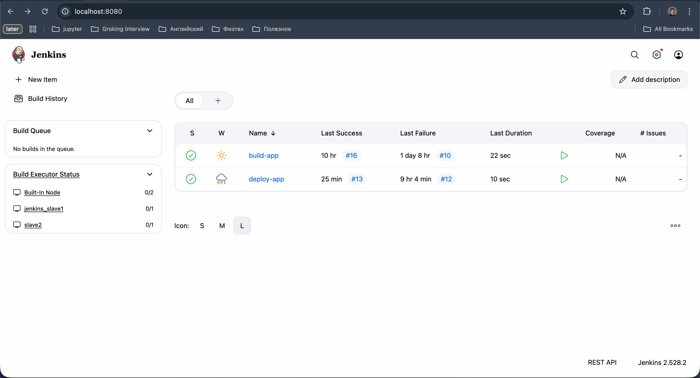
   - 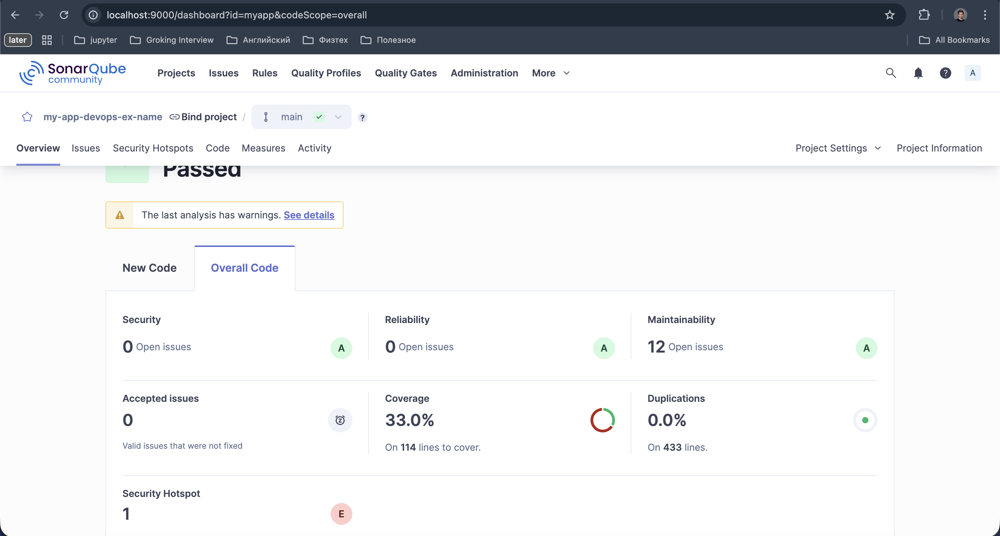
   - 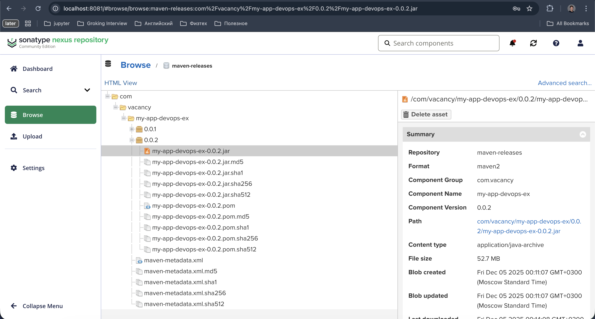
4. Настройка агентов для сборки. Я использовал двух агентов, которые запускаются в отдельных контейнерах. jenkins_slave1 - 
отвечает за build джобу, также в этот агент был установлен allure для корректно генерации отчетов по тестам; 
jenkins_slave2 - отвечает за деплой джобу. Дополнительно в агентах потребовалось отладить подключение
по SSH и установить 17 джаву. 
5. Настроил подключение через ключ для SonarQube. В настройках сонара был сгенерирован токен, который затем добавлен 
в Jenkins
6. При настройке Nexus был создал локальный пользователь, который использовался при загрузке и выгрузке приложения 
7. Результаты работы build джобы:
    - Успешная работы джобы: 
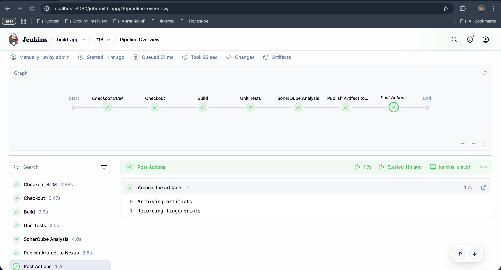
    - Отчет в allure
      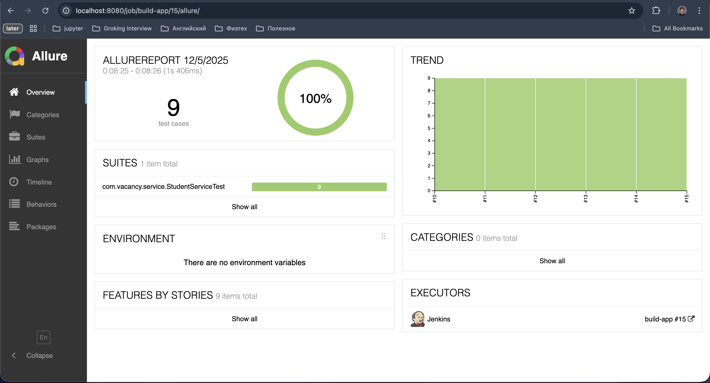
    - Отчет в SonarQube

    - Приложение в nexus
      
8. Затем была настроена Deploy джоба, в которой использовался второй агент, а также развернутая инфраструктра: ansible-host, 
отдельный контейнер для приложения. Для этой джобы создан отдельные репозиторий: https://github.com/goldenchest19/my-app-devops-deploy 
Для запуска я перешел в папку ansible и выполнил команды
    - docker build -t ubuntu-ssh -f ./dockerfileUbuntu .
    - docker run -d -p 2222:22 --name ubuntu-ssh-container ubuntu-ssh 
    - docker build -t ubuntu-ansible-ssh -f ./dockerfileUbuntuHost .
    - docker-compose up -d
9. После запуска контейнеров отдельно протестировал функционал ansible. Для этого расположил ansible в одной сети с остальными контейнерами. 
Затем с помощью curl скачал образ в ansible-host:
    - root@6e049781c61e:/ansible# curl -L -u admin:pass \
      http://nexus:8081/repository/maven-releases/com/vacancy/my-app-devops-ex/0.0.2/my-app-devops-ex-0.0.2.jar -o /ansible/app.jar
    - Результат:
      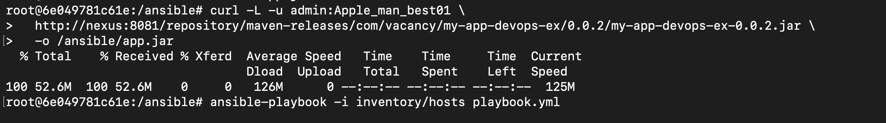
10. Далее запустил удаленный запуск приложения с помощью ansible 
    - ansible-playbook -i inventory/hosts playbook.yml
    - Результат:
      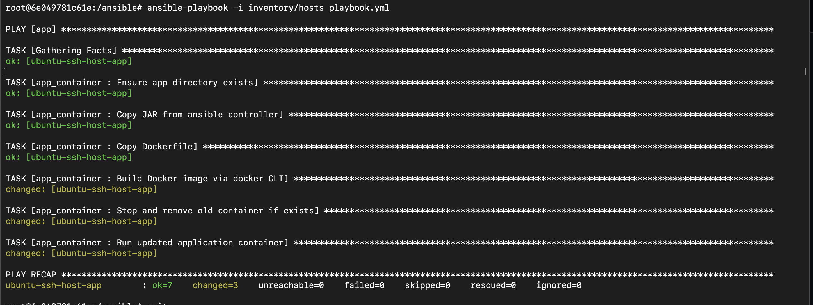
      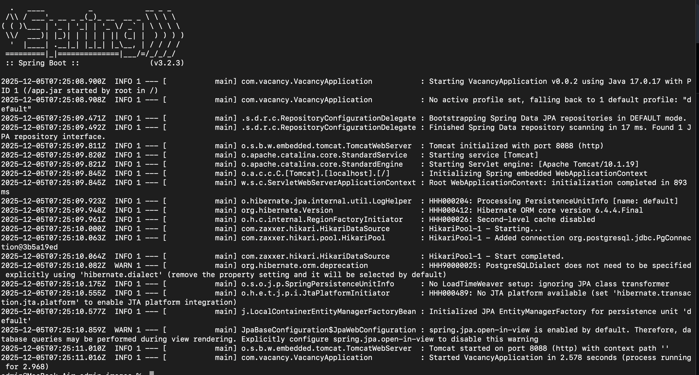
11. Затем я удалил этот контейнер и образ, который скачивал. Сделано это для провекри автоматизированной джобы.
12. После проверки ansible я настроил взаимодействие между Jenkins и ansible. Для этого сгенерировал ключ в контейнере jenkins
и прописал его в контейнере ansible, а также добавил в Jenkins cred. 
13. Результаты работы deploy джобы
    - Jenkins pipline
      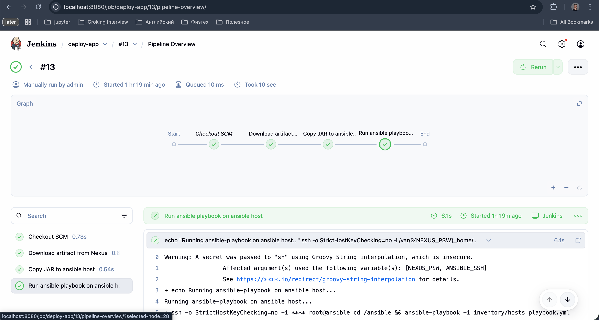
    - Запущенные контейнеры:
      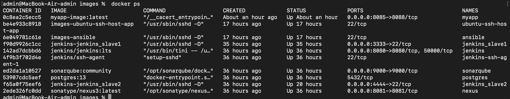
    - Swagger UI
      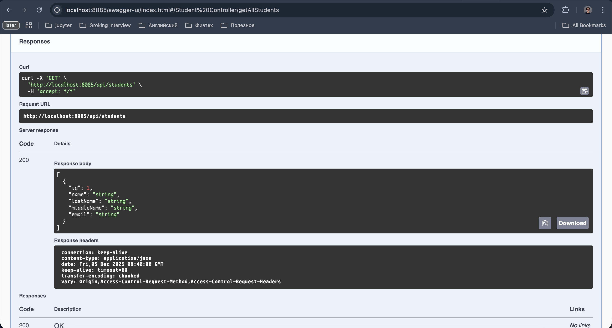
    - 

    